# Bharpett

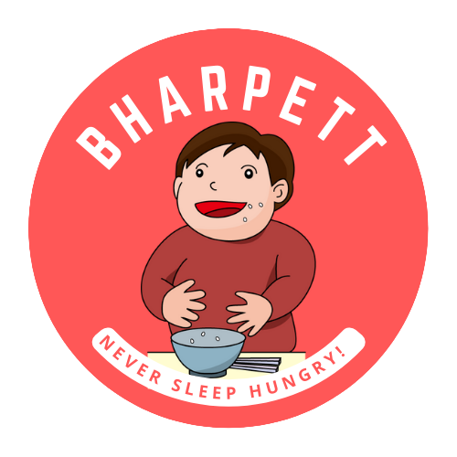

An application that helps the Users, find the cheapest and nearest food sources for Donating to the poor, needy ones.
The app consists of two registration options - 
1)Donator 2)Volunteer.
The Donator can donate food or money via the app. Whenever the Volunteer registers or logins, the app recommends the nearest, cheapest food donation drive and also calculates the number of people that would be able to suffice their hunger with the current money in the volunteer's wallet.

## Tech Stack

**Frontend:** Flutter

**Backend:** Django

**Database:** SQLite

**Programming Languages:** Python, Dart

## What is this project about?

* Around 8.9% of the entire world population goto bed on a hungry stomach.
* Bharpett aims at providing an effective solution for reducing and eliminating hunger.
* With a User friendly GUI and a smart system which recommends the best food source near you, Bharpett is a comprehensive paradigm for Zero Hunger.

## Screenshots

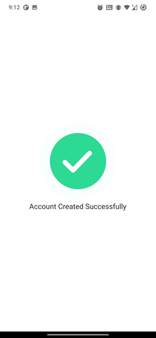
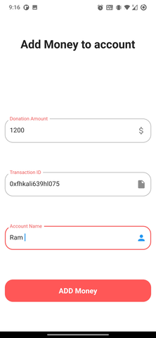
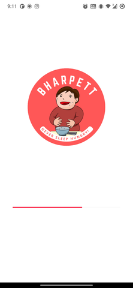
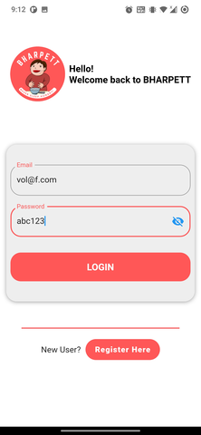
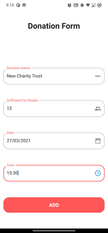
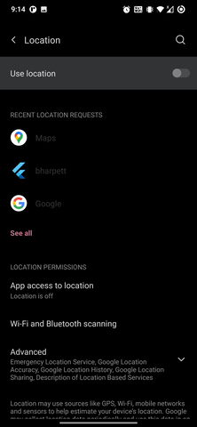
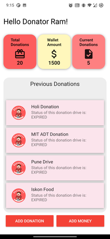
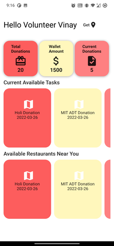
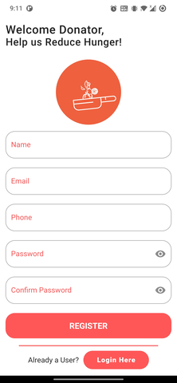
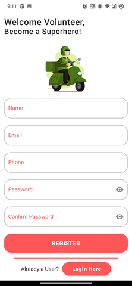
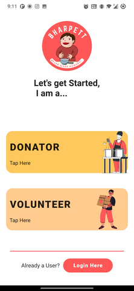
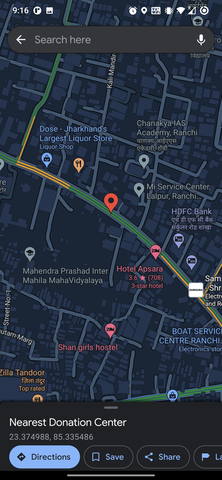

## _API DOCS_ 

LOGIN : post : used to login 

> https://bharpett.herokuapp.com/

REGISTER : post : used to register

> https://bharpett.herokuapp.com/accounts/register/

USER DATA : get : used to get user data

> https://bharpett.herokuapp.com/accounts/user-data/

GET ALL RESTAURANTS : post : used to get all restaurants near  user's location

> https://bharpett.herokuapp.com/api/get_all_restaurants/

GET SINGLE RESTAURANT : get : used to get detailed information about a restaurant

> https://bharpett.herokuapp.com/api/get_single_restaurant/<int:id>/

GET RECOMMENDED RESTAURANTS : post : used to get restaurants filtered under basis of distance, 
average-cost, rating, votes, etc. 
> https://bharpett.herokuapp.com/api/get_recommended_restaurants/

DONATE : post : used to donate food by posting information about it.

>https://bharpett.herokuapp.com/api/donate/

MY DONATIONS : get : used to get all donations posted by a particular user

> https://bharpett.herokuapp.com/api/get_my_donations/

ALL DONATIONS : post : used to get all donations based on user's location

> https://bharpett.herokuapp.com/api/get_all_donations/
